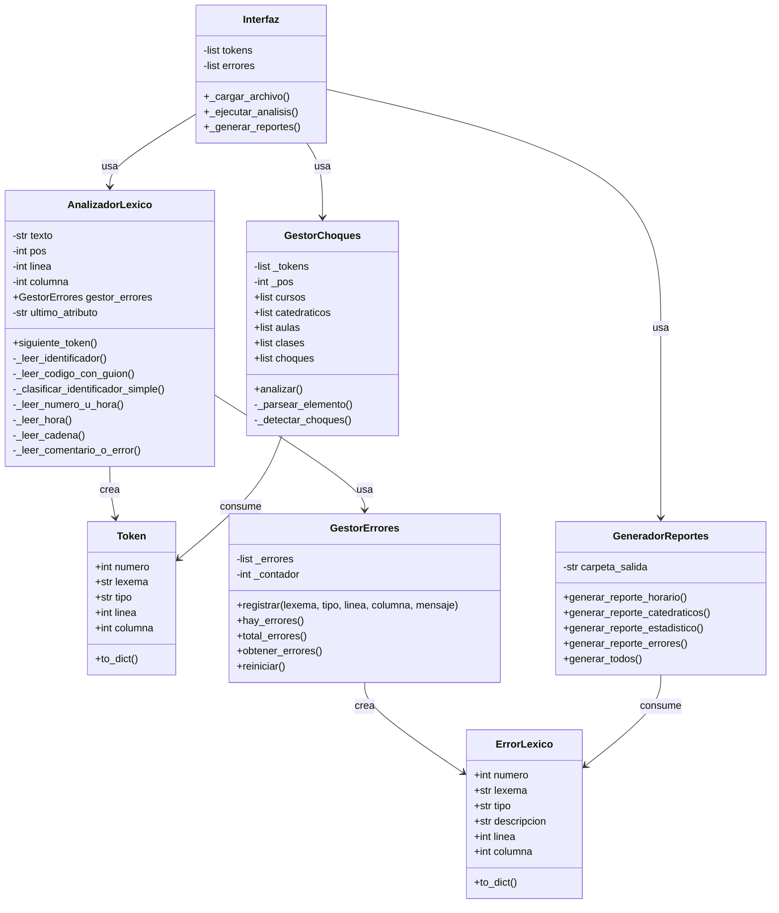
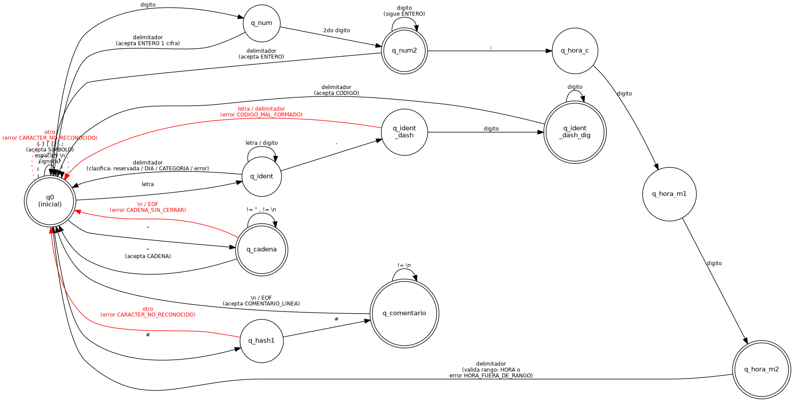

# Manual Técnico — HorarioScript

Proyecto 1 — Lenguajes Formales y de Programación (2S-2026)
Autor: Sergio Roberto Gudiel Sian — Carné 201404365

## 1. Arquitectura del sistema

El proyecto sigue el patrón **MVC (Modelo-Vista-Controlador)**:

- **`models/`** — clases de datos puras, sin lógica de negocio:
  - `Token.py`: representa un token reconocido por el AFD.
  - `ErrorLexico.py`: representa un error léxico detectado.
- **`controllers/`** — la lógica del sistema:
  - `AnalizadorLexico.py`: el AFD manual (clase exigida por el enunciado, método `siguiente_token()`).
  - `GestorErrores.py`: acumula errores en modo pánico (clase exigida por el enunciado).
  - `GestorChoques.py`: reconstruye el modelo del horario a partir de los tokens y detecta choques.
  - `GeneradorReportes.py`: genera los 3 reportes HTML obligatorios + 1 reporte adicional de errores (clase exigida por el enunciado).
- **`views/`** — interfaz gráfica:
  - `Interfaz.py`: clase principal de la GUI en Tkinter (exigida por el enunciado).
- **`main.py`**: punto de entrada, crea la ventana raíz y monta `Interfaz`.

**Nota sobre la estructura de carpetas:** el enunciado sugiere la
estructura `/src /docs /tests /examples`. Se optó por una arquitectura
MVC explícita (`models/`, `controllers/`, `views/`) en su lugar,
porque separa con mayor claridad los datos (Token, ErrorLexico), la
lógica (AnalizadorLexico, GestorChoques, GeneradorReportes) y la
presentación (Interfaz) — y porque los 5 nombres de clase exigidos
literalmente por el enunciado (`Token`, `AnalizadorLexico`,
`GestorErrores`, `GeneradorReportes`, la clase de interfaz) se
conservan sin cambios dentro de esta estructura. La carpeta `docs/`
se mantiene igual que lo sugerido, y `examples/` se usa para los
archivos `.hor` de prueba.

## 2. Diagrama de clases



## 3. Diagrama del AFD (estados y transiciones)

Generado con Graphviz (herramienta obligatoria según el enunciado).
Código fuente: `docs/afd_horarioscript.dot`. Imagen renderizada:



Para volver a generar la imagen a partir del `.dot` (si se necesita):

```bash
dot -Tpng docs/afd_horarioscript.dot -o docs/afd_horarioscript.png
```

## 4. Tabla de transiciones del AFD

| Estado | Entrada | Transición | Acción |
|---|---|---|---|
| q0 (inicial) | espacio/tab/\n | q0 | ignora, actualiza línea/columna |
| q0 | letra | q_ident | inicia lexema |
| q0 | dígito | q_num | inicia lexema |
| q0 | `"` | q_cadena | marca posición de apertura |
| q0 | `#` | q_hash1 | — |
| q0 | `{ } [ ] : , ;` | — | acepta SIMBOLO (1 carácter) |
| q0 | otro | q0 | error CARACTER_NO_RECONOCIDO |
| q_ident | letra/dígito | q_ident | acumula |
| q_ident | `-` | q_ident_dash | acumula '-' |
| q_ident | delimitador | — | clasifica lexema (ver sección 6) |
| q_ident_dash | dígito | q_ident_dash_dig | acumula |
| q_ident_dash | letra/delimitador | — | error CODIGO_MAL_FORMADO |
| q_ident_dash_dig | dígito | q_ident_dash_dig | acumula |
| q_ident_dash_dig | delimitador | — | acepta CODIGO |
| q_num | dígito (1º) | q_num | acumula |
| q_num | dígito (2º) | q_num2 | acumula |
| q_num2 | `:` | q_hora_c | inicia HORA |
| q_num2 | dígito | q_num2 | continúa como ENTERO |
| q_num / q_num2 | delimitador | — | acepta ENTERO |
| q_hora_c | dígito | q_hora_m1 | acumula minutos |
| q_hora_m1 | dígito | q_hora_m2 | acumula |
| q_hora_m2 | delimitador | — | valida rango 06:00-21:00 → HORA o error HORA_FUERA_DE_RANGO |
| q_hash1 | `#` | q_comentario | — |
| q_hash1 | otro | q0 | error CARACTER_NO_RECONOCIDO |
| q_comentario | ≠ `\n` | q_comentario | acumula |
| q_comentario | `\n`/EOF | q0 | acepta COMENTARIO_LINEA |
| q_cadena | ≠ `"`, ≠ `\n` | q_cadena | acumula |
| q_cadena | `"` | q0 | acepta CADENA |
| q_cadena | `\n`/EOF | q0 | error CADENA_SIN_CERRAR |

## 5. Algoritmo de tokenización

`AnalizadorLexico.siguiente_token()` implementa el AFD **carácter a
carácter**, usando solo indexación (`self.texto[self.pos]`) y
comparaciones directas — sin el módulo `re` ni `split`/`find`, según
lo exige la sección 6 del enunciado (Tecnología establecida). Se
permite el uso de `isalpha()`/`isdigit()` porque clasifican un
carácter individual y no tokenizan (confirmado con el auxiliar del
curso).

El método mantiene tres punteros de posición (`self.pos`, `self.linea`,
`self.columna`) que se actualizan en cada llamada a `_avanzar()`. Cada
llamada a `siguiente_token()` devuelve exactamente un `Token`, o
`None` al llegar a EOF, permitiendo un recorrido tipo iterador sobre
el archivo completo. Si se detecta un error léxico, se registra en
`GestorErrores` y el método se vuelve a invocar recursivamente
(`return self.siguiente_token()`), lo que implementa el **modo
pánico**: el análisis nunca se detiene por un error individual.

## 6. Lógica de clasificación de identificadores

Un identificador sin guión se clasifica, en orden, contra: palabras
reservadas de bloque (`PR_BLOQUE`), de elemento (`PR_ELEMENTO`), de
relación (`PR_RELACION`), de atributo (`PR_ATRIBUTO`), días válidos
(`DIA`) y categorías válidas (`CATEGORIA`). Si no calza en ninguna,
se usa una variable de contexto mínima, `self.ultimo_atributo`
(el último `PR_ATRIBUTO` visto), para decidir entre
`DIA_NO_RECONOCIDO` (si el atributo anterior fue `dia`) y
`CODIGO_MAL_FORMADO` (en cualquier otro caso). Esta es la única
"memoria" de contexto que usa el analizador; todo lo demás es
puramente léxico, carácter por carácter.

## 7. Lógica de detección de choques de horario

`GestorChoques` no es un parser sintáctico completo (eso corresponde
al Proyecto 2, según el propio enunciado). Es un recorrido secuencial
ligero sobre la lista de tokens ya reconocidos, que reconstruye la
jerarquía `CURSOS / CATEDRATICOS / AULAS / CLASES` en una estructura
de diccionarios Python.

Una vez construido el modelo, se comparan **todas las parejas de
clases** (complejidad O(n²), aceptable dado el tamaño esperado de un
horario académico). Dos clases entran en choque si:

1. Tienen el mismo valor de `dia`, **y**
2. Comparten el mismo `catedratico_ref` **o** la misma `aula_ref`, **y**
3. Sus bloques horarios se traslapan: `inicio_A < fin_B` **y**
   `inicio_B < fin_A` (condición estándar de traslape de intervalos).

## 8. Justificación de decisiones de diseño

- **Decisión A — `PR_ATRIBUTO`:** se agregó como tipo de token
  reservado propio (codigo, creditos, categoria, capacidad, edificio,
  dia, inicio, fin, seccion) porque el enunciado no los menciona
  explícitamente en la tabla de palabras reservadas, pero el ejemplo
  de la sección 4.6 los usa constantemente. Se decidió guiarse por el
  ejemplo sobre la letra de la tabla, confirmado con el auxiliar.
- **Decisión B — CADENA vs comillas:** todo lo que aparece entre
  comillas dobles es `CADENA`, sin excepción, incluso si su contenido
  tiene forma de código (ej. `"LFP-0796"`). Confirmado con el
  auxiliar: "si genera errores o no no hay problema, mientras se
  indique y se sepa explicar".
- **Decisión C — patrón de `CODIGO`:** dado que el enunciado es
  inconsistente entre "3 letras + guión + dígitos" y ejemplos como
  `BD2-0812` o `T-3`, se usó un patrón flexible: prefijo alfanumérico
  que inicia con letra, un guión, y uno o más dígitos. Solo aplica a
  texto **sin comillas** (ver Decisión B).
- **Decisión D — `HORA_FUERA_DE_RANGO`:** se agregó un quinto tipo de
  error no listado en la tabla original de errores léxicos, porque
  los casos de prueba exigidos por el enunciado piden explícitamente
  el caso "hora fuera de rango".
- **Umbrales de carga de catedráticos** (Reporte 2): se usaron los
  sugeridos por el enunciado (BAJA 1-4h, NORMAL 5-10h, ALTA 11-15h,
  SATURADA 16h+), sin modificación.
- **Ocupación de aulas** (Reporte 3): el enunciado no define el total
  de horas disponibles por aula. Se asumió **90 horas semanales**
  (6 días × 15 horas institucionales, de 06:00 a 21:00, el mismo
  rango válido para el token HORA), documentado directamente en el
  reporte generado.

## 9. Restricciones técnicas cumplidas

- No se usó el módulo `re`.
- No se usaron `split()`, `find()` ni funciones equivalentes para la
  tokenización principal — solo indexación de caracteres y
  comparaciones (`isalpha()`, `isdigit()` incluidos, por ser
  clasificación de un solo carácter).
- No se usaron librerías generadoras de analizadores léxicos (ply o
  similares).