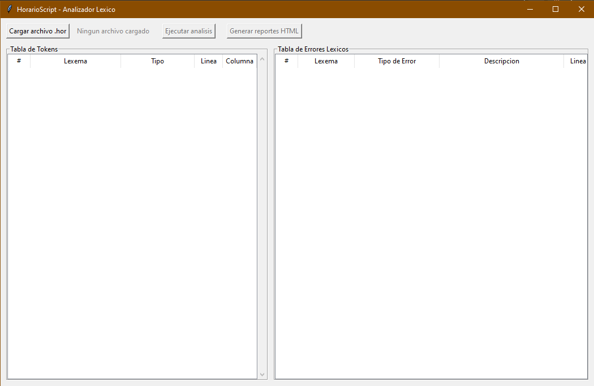
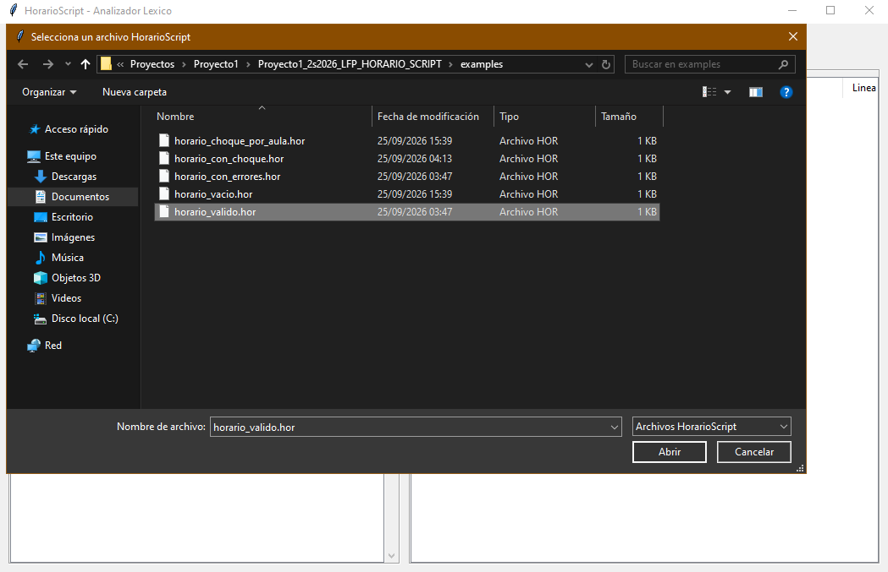
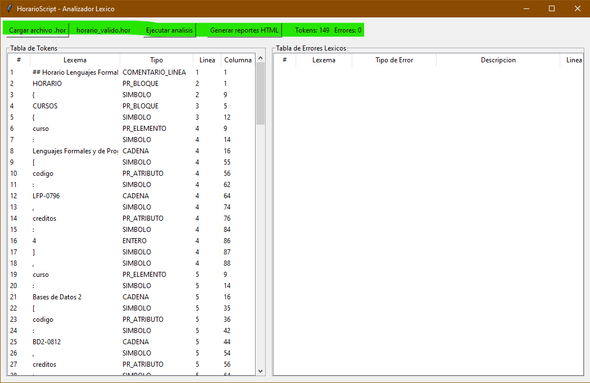
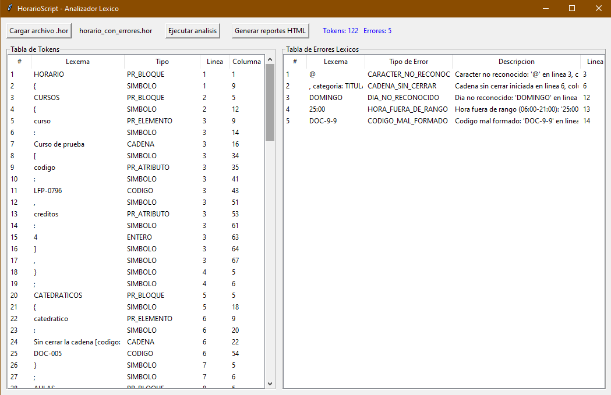
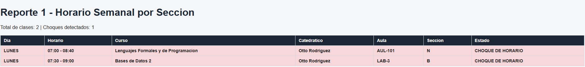
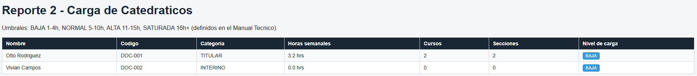
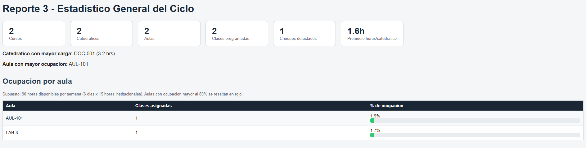

# Manual de Usuario — HorarioScript

Proyecto 1 — Lenguajes Formales y de Programación (2S-2026)
Autor: Sergio Roberto Gudiel Sian — Carné 201404365

## 1. Requisitos

- Python 3.10 o superior instalado.
- Ninguna librería externa: Tkinter viene incluido con Python en Windows.

## 2. Cómo ejecutar la aplicación

1. Abre una terminal (PowerShell) dentro de la carpeta del proyecto.
2. Ejecuta:

```bash
   python main.py
```

3. Se abrirá la ventana principal de la aplicación.



## 3. Estructura de un archivo .hor

Un archivo HorarioScript (extensión `.hor`) describe el horario de un
ciclo académico con un bloque raíz `HORARIO` que contiene cuatro
secciones: `CURSOS`, `CATEDRATICOS`, `AULAS` y `CLASES`. Ejemplo
mínimo:

HORARIO {
CURSOS {
curso: "Lenguajes Formales y de Programacion" [codigo: "LFP-0796", creditos: 4],
};
CATEDRATICOS {
catedratico: "Otto Rodriguez" [codigo: "DOC-001", categoria: TITULAR],
};
AULAS {
aula: "AUL-101" [capacidad: 40, edificio: "T-3"],
};
CLASES {
clase: "LFP-0796" con "DOC-001" en "AUL-101" [dia: LUNES, inicio: 07:00, fin: 08:40, seccion: "N"],
};
};


- Los comentarios inician con `##` y van hasta el final de la línea.
- Los textos (nombres, códigos entre comillas) van entre comillas
  dobles `" "`.
- Las horas usan formato `HH:MM`, entre `06:00` y `21:00`.
- Hay varios archivos de ejemplo listos para usar en la carpeta
  `examples/` del proyecto.

## 4. Cómo cargar y analizar un archivo

1. Clic en el botón **"Cargar archivo .hor"**.
2. En el explorador de Windows, navega hasta la carpeta `examples/`
   del proyecto y selecciona un archivo (por ejemplo,
   `horario_valido.hor`).
3. El nombre del archivo aparece junto al botón, y se habilita el
   botón **"Ejecutar análisis"**.



4. Clic en **"Ejecutar análisis"**. El analizador léxico procesa el
   archivo completo y llena las dos tablas de la parte inferior.

## 5. Cómo interpretar la tabla de tokens

La tabla izquierda muestra **cada token reconocido** por el AFD, en
el orden en que aparece en el archivo, con: número consecutivo,
lexema (el texto exacto encontrado), tipo de token, línea y columna
donde inicia.



En la parte superior, junto al botón de análisis, se muestra el
resumen: total de tokens y total de errores encontrados.

## 6. Cómo interpretar la tabla de errores

La tabla derecha muestra **cada error léxico detectado**, con:
número, el lexema o carácter que causó el error, el tipo de error
(uno de los 5 definidos: `CARACTER_NO_RECONOCIDO`,
`CADENA_SIN_CERRAR`, `DIA_NO_RECONOCIDO`, `CODIGO_MAL_FORMADO`,
`HORA_FUERA_DE_RANGO`), una descripción legible del problema, y la
línea/columna exacta donde ocurrió.



**Importante:** el análisis nunca se detiene por un error — el
programa sigue leyendo el resto del archivo y reporta todos los
errores encontrados en una sola pasada (modo pánico).

## 7. Cómo generar y navegar los reportes HTML

1. Después de ejecutar un análisis, clic en **"Generar reportes
   HTML"**.
2. Se crea (o actualiza) una carpeta `reportes/` en el proyecto con
   4 archivos HTML, y se abre automáticamente el primero en tu
   navegador.
3. Aparece también una ventana de confirmación con la lista de
   archivos generados y, si aplica, cuántos choques de horario se
   detectaron.

### Reporte 1 — Horario semanal

Muestra todas las clases ordenadas por día y hora, con el nombre del
curso, catedrático, aula, sección y estado. Las clases en conflicto
se resaltan en **rojo** con la etiqueta "CHOQUE DE HORARIO".



### Reporte 2 — Carga de catedráticos

Muestra, por cada catedrático, sus horas semanales asignadas, número
de cursos y secciones, y un indicador de color según su nivel de
carga (azul = BAJA, verde = NORMAL, naranja = ALTA, rojo = SATURADA).



### Reporte 3 — Estadístico general

Muestra un resumen ejecutivo (KPIs) del horario procesado: total de
cursos, catedráticos, aulas, clases y choques detectados, además de
una tabla de ocupación por aula con barra de progreso visual.



Los 4 archivos (`reporte1_horario.html`, `reporte2_catedraticos.html`,
`reporte3_estadistico.html` y `reporte_errores.html`) se pueden abrir
en cualquier momento haciendo doble clic sobre ellos en la carpeta
`reportes/`, sin necesidad de volver a correr la aplicación.

## 8. Solución de problemas comunes

- **El botón "Ejecutar análisis" está deshabilitado:** primero debes
  cargar un archivo con "Cargar archivo .hor".
- **No aparece ningún choque de horario aunque debería:** confirma
  que las clases en conflicto tengan exactamente el mismo valor en
  `dia` y que sus horarios se traslapen (no basta con que sean del
  mismo catedrático o aula si son días distintos).
- **El navegador no abre el reporte automáticamente:** ve manualmente
  a la carpeta `reportes/` del proyecto y abre
  `reporte1_horario.html` con doble clic.